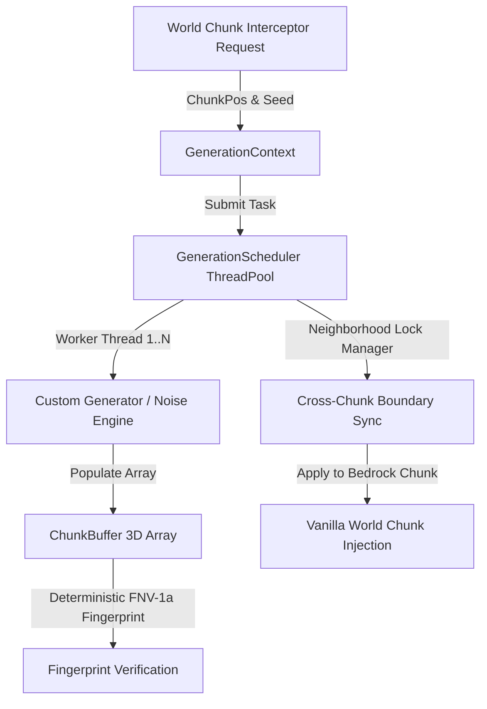

# Endstone WorldGen API

[](https://github.com/TheNINJALLO/endstone-worldgen-api/releases/tag/v0.4.5-beta.29)
[](https://github.com/EndstoneMC/endstone)
[](https://www.minecraft.net/en-us/download/server/bedrock)
[](https://github.com/TheNINJALLO/endstone-worldgen-api/actions)
[](#-direct-release-downloads-v045-beta29)
[](#-c--python-api-quickstart)
[](LICENSE)

A high-performance **Chunk Interceptor**, detached **Parallel Generation**, and **Scheduler** API for Endstone Bedrock Dedicated Servers (BDS).

Generator and populator work runs off the main thread. Live chunk capture and world commit remain on the primary thread and are limited to one of each per server tick by default.

---

## 📚 Documentation & Technical Wiki

Comprehensive guides, architecture diagrams, stress testing tutorials, and full API specifications are available on the [**Docsify Documentation Site**](docs/README.md).

---

## 📦 Direct Release Downloads (`v0.4.5-beta.29`)

Use the **complete ZIP** matching the server's exact BDS build and platform when installing the `/wg` wheel; it contains the native plugin and `_endstone_worldgen_live` bridge. The raw library downloads are for C++-only/manual installations and do not contain that bridge.

| Platform | BDS Version | Artifact Filename | Direct Download |
| :--- | :--- | :--- | :--- |
| **Windows x64 ZIP (recommended)** | `1.26.32` | `endstone-worldgen-api-v0.4.5-beta.29-bds-1.26.32-windows-x64.zip` | [Download](https://github.com/TheNINJALLO/endstone-worldgen-api/releases/download/v0.4.5-beta.29/endstone-worldgen-api-v0.4.5-beta.29-bds-1.26.32-windows-x64.zip) |
| **Windows x64 ZIP (recommended)** | `1.26.33` | `endstone-worldgen-api-v0.4.5-beta.29-bds-1.26.33-windows-x64.zip` | [Download](https://github.com/TheNINJALLO/endstone-worldgen-api/releases/download/v0.4.5-beta.29/endstone-worldgen-api-v0.4.5-beta.29-bds-1.26.33-windows-x64.zip) |
| **Linux x64 ZIP (recommended)** | `1.26.32` | `endstone-worldgen-api-v0.4.5-beta.29-bds-1.26.32-linux-x64.zip` | [Download](https://github.com/TheNINJALLO/endstone-worldgen-api/releases/download/v0.4.5-beta.29/endstone-worldgen-api-v0.4.5-beta.29-bds-1.26.32-linux-x64.zip) |
| **Linux x64 ZIP (recommended)** | `1.26.33` | `endstone-worldgen-api-v0.4.5-beta.29-bds-1.26.33-linux-x64.zip` | [Download](https://github.com/TheNINJALLO/endstone-worldgen-api/releases/download/v0.4.5-beta.29/endstone-worldgen-api-v0.4.5-beta.29-bds-1.26.33-linux-x64.zip) |
| **Windows x64 raw plugin** | `1.26.32` | `endstone-worldgen-api-v0.4.5-beta.29-bds-1.26.32-windows-x64.dll` | [Download](https://github.com/TheNINJALLO/endstone-worldgen-api/releases/download/v0.4.5-beta.29/endstone-worldgen-api-v0.4.5-beta.29-bds-1.26.32-windows-x64.dll) |
| **Windows x64 raw plugin** | `1.26.33` | `endstone-worldgen-api-v0.4.5-beta.29-bds-1.26.33-windows-x64.dll` | [Download](https://github.com/TheNINJALLO/endstone-worldgen-api/releases/download/v0.4.5-beta.29/endstone-worldgen-api-v0.4.5-beta.29-bds-1.26.33-windows-x64.dll) |
| **Linux x64 raw plugin** | `1.26.32` | `endstone-worldgen-api-v0.4.5-beta.29-bds-1.26.32-linux-x64.so` | [Download](https://github.com/TheNINJALLO/endstone-worldgen-api/releases/download/v0.4.5-beta.29/endstone-worldgen-api-v0.4.5-beta.29-bds-1.26.32-linux-x64.so) |
| **Linux x64 raw plugin** | `1.26.33` | `endstone-worldgen-api-v0.4.5-beta.29-bds-1.26.33-linux-x64.so` | [Download](https://github.com/TheNINJALLO/endstone-worldgen-api/releases/download/v0.4.5-beta.29/endstone-worldgen-api-v0.4.5-beta.29-bds-1.26.33-linux-x64.so) |
| **Python Wheel** | `CPython 3.12` | `endstone_worldgen_studio-0.4.5b29-py3-none-any.whl` | [Download](https://github.com/TheNINJALLO/endstone-worldgen-api/releases/download/v0.4.5-beta.29/endstone_worldgen_studio-0.4.5b29-py3-none-any.whl) |

---

## 🏛️ Architecture Overview



---

## ⚡ Quickstart Code Examples

### Python API Example
```python
from endstone_worldgen import (
    GenerationScheduler,
    GenerationContext,
    ChunkPos,
    FlatGenerator,
)

# 1. Initialize multi-worker thread pool
scheduler = GenerationScheduler(workers=4)

# 2. Configure generation context
ctx = GenerationContext(world_seed=12345, dimension="overworld", chunk=ChunkPos(0, 0))

# 3. Generate terrain chunk asynchronously
future = scheduler.generate(ctx, FlatGenerator(surface_y=64, base=1, top=2))
chunk_buffer = future.result()

print(f"Generated Chunk (0,0) Fingerprint: {hex(chunk_buffer.fingerprint())}")
print(f"Surface block at (0,64,0): {chunk_buffer.get(0, 64, 0)}")

scheduler.close()
```

### C++ API Example
```cpp
#include <endstone_worldgen/worldgen_service.h>
#include <endstone/endstone.hpp>
#include <memory>
#include <string>
#include <utility>

void registerPopulator(
    endstone::Server &server,
    std::shared_ptr<endstone_worldgen::IPopulator> populator) {
    using namespace endstone_worldgen;
    auto worldgen = server.getServiceManager().load<WorldGenService>(
        std::string(WorldGenServiceName));
    if (!worldgen) return;

    const auto diagnostics = worldgen->diagnostics();
    const auto stats = worldgen->stats();
    server.getLogger().info("WorldGen: committed={}, waiting={}",
                            stats.committed, stats.waiting);
    if (diagnostics.exact_build_match && worldgen->interceptionActive()) {
        worldgen->registerPopulator(std::move(populator));
    }
}
```

---

## 🎮 In-Game Studio Test Suite (`/wg`)

The repository includes a packaged Python wheel studio plugin [`endstone_worldgen_studio`](examples/python/world_gen_studio_plugin/). The wheel and its ABI-tagged native bridge require the Endstone host to run **CPython 3.12**. It calls the exact bundle's `_endstone_worldgen_live` bridge, so expose the extracted bundle's `python/` directory to Endstone before installing the wheel (or copy that directory's contents into Endstone's Python `site-packages`):

```bash
# Use the python/ directory from the same OS and BDS build as the native plugin.
export PYTHONPATH=/path/to/extracted/exact-bundle/python${PYTHONPATH:+:$PYTHONPATH}

# Place the command-test wheel in the Endstone server's plugins/ directory.
cp endstone_worldgen_studio-0.4.5b29-py3-none-any.whl /path/to/endstone/plugins/
```

### In-Game Command Reference
| Command | Usage | Description |
| :--- | :--- | :--- |
| `/wg status` | `/wg status` | Displays live native interceptor, queue, and adapter counters. |
| `/wg gen <flat\|island\|maze\|ores>` | `/wg gen island 0 0` | Runs a detached reference-buffer generator after checking the native service. |
| `/wg structure <castle\|arena>` | `/wg structure castle 0 0` | Runs a detached 3x3 reference-buffer test. |
| `/wg benchmark [chunk_count]` | `/wg benchmark 100` | Benchmarks up to 128 detached Python reference buffers. |
| `/wg inspect [cx] [cz]` | `/wg inspect 0 0` | Displays a reference buffer alongside live native counters. |

---

## 📚 Documentation & Wiki

Full technical documentation, architecture deep dives, and API reference manuals are available in the project Wiki:

- 📖 [Documentation Index](docs/README.md)
- 🏗️ [Architecture & Multi-Threading Model](docs/ARCHITECTURE.md)
- ⚙️ [Generators, Contexts & Pipeline Stages](docs/generators_and_stages.md)
- 🔒 [Neighborhood Boundary Lock Engine](docs/neighborhood_locking.md)
- 📘 [Complete API Reference](docs/api_reference.md)
- 💡 [Code Examples & Recipes](examples/python/)

---

## 📜 License

Distributed under the [Apache License 2.0](LICENSE).
