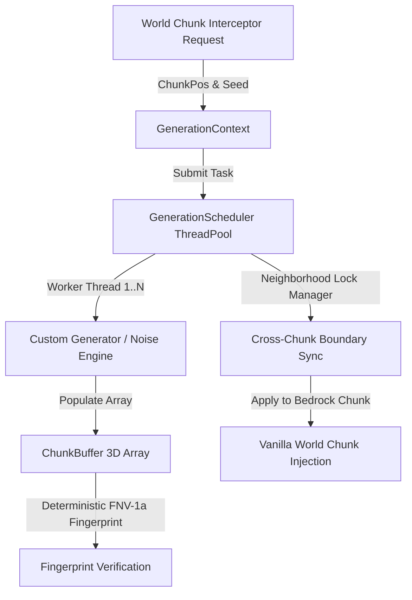

# Endstone WorldGen API

[](https://github.com/TheNINJALLO/endstone-worldgen-api/releases/tag/v0.4.7)
[](https://github.com/EndstoneMC/endstone)
[](https://www.minecraft.net/en-us/download/server/bedrock)
[](https://github.com/TheNINJALLO/endstone-worldgen-api/actions/workflows/ci.yml)
[](#-direct-release-downloads-v047)
[](#-c--python-api-quickstart)
[](LICENSE)

A high-performance **Chunk Interceptor**, detached **Parallel Generation**, and **Scheduler** API for Endstone Bedrock Dedicated Servers (BDS).

Generator and populator work runs off the main thread. Initial live capture and
world commit remain on the primary thread and are limited to one of each per
server tick by default; a changed automatic result performs one additional
conflict-checking recapture immediately before its delta merge.

---

## 📚 Documentation & Technical Wiki

Comprehensive guides, architecture diagrams, stress testing tutorials, and full API specifications are available on the [**Docsify Documentation Site**](docs/README.md).

---

## 📦 Direct Release Downloads (`v0.4.7`)

Use the **complete ZIP** matching BDS 1.26.33 and the server platform. It contains both the native plugin and the matching self-contained `/wg` command wheel. The raw library is for native-API-only/manual installations.

| Platform | BDS Version | Artifact Filename | Direct Download |
| :--- | :--- | :--- | :--- |
| **Windows x64 ZIP (recommended)** | `1.26.33` | `endstone-worldgen-api-v0.4.7-bds-1.26.33-windows-x64.zip` | [Download](https://github.com/TheNINJALLO/endstone-worldgen-api/releases/download/v0.4.7/endstone-worldgen-api-v0.4.7-bds-1.26.33-windows-x64.zip) |
| **Linux x64 ZIP (recommended)** | `1.26.33` | `endstone-worldgen-api-v0.4.7-bds-1.26.33-linux-x64.zip` | [Download](https://github.com/TheNINJALLO/endstone-worldgen-api/releases/download/v0.4.7/endstone-worldgen-api-v0.4.7-bds-1.26.33-linux-x64.zip) |
| **Windows x64 raw plugin** | `1.26.33` | `endstone-worldgen-api-v0.4.7-bds-1.26.33-windows-x64.dll` | [Download](https://github.com/TheNINJALLO/endstone-worldgen-api/releases/download/v0.4.7/endstone-worldgen-api-v0.4.7-bds-1.26.33-windows-x64.dll) |
| **Linux x64 raw plugin** | `1.26.33` | `endstone-worldgen-api-v0.4.7-bds-1.26.33-linux-x64.so` | [Download](https://github.com/TheNINJALLO/endstone-worldgen-api/releases/download/v0.4.7/endstone-worldgen-api-v0.4.7-bds-1.26.33-linux-x64.so) |
| **Windows `/wg` wheel** | `CPython 3.14` | `endstone_worldgen_studio-0.4.7-cp314-cp314-win_amd64.whl` | [Download](https://github.com/TheNINJALLO/endstone-worldgen-api/releases/download/v0.4.7/endstone_worldgen_studio-0.4.7-cp314-cp314-win_amd64.whl) |
| **Linux `/wg` wheel** | `CPython 3.14` | `endstone_worldgen_studio-0.4.7-cp314-cp314-linux_x86_64.whl` | [Download](https://github.com/TheNINJALLO/endstone-worldgen-api/releases/download/v0.4.7/endstone_worldgen_studio-0.4.7-cp314-cp314-linux_x86_64.whl) |

---

## 🏛️ Architecture Overview



---

## ⚡ Quickstart Code Examples

### Python API Example
```python
from endstone_worldgen import (
    GenerationScheduler,
    GenerationContext,
    ChunkPos,
    FlatGenerator,
)

# 1. Initialize multi-worker thread pool
scheduler = GenerationScheduler(workers=4)

# 2. Configure generation context
ctx = GenerationContext(world_seed=12345, dimension="overworld", chunk=ChunkPos(0, 0))

# 3. Generate terrain chunk asynchronously
future = scheduler.generate(ctx, FlatGenerator(surface_y=64, base=1, top=2))
chunk_buffer = future.result()

print(f"Generated Chunk (0,0) Fingerprint: {hex(chunk_buffer.fingerprint())}")
print(f"Surface block at (0,64,0): {chunk_buffer.get(0, 64, 0)}")

scheduler.close()
```

### C++ API Example
```cpp
#include <endstone_worldgen/worldgen_service.h>
#include <endstone/endstone.hpp>
#include <memory>
#include <string>
#include <utility>

void registerPopulator(
    endstone::Server &server,
    std::shared_ptr<endstone_worldgen::IPopulator> populator) {
    using namespace endstone_worldgen;
    auto worldgen = server.getServiceManager().load<WorldGenService>(
        std::string(WorldGenServiceName));
    if (!worldgen) return;

    const auto diagnostics = worldgen->diagnostics();
    const auto stats = worldgen->stats();
    server.getLogger().info("WorldGen: committed={}, waiting={}",
                            stats.committed, stats.waiting);
    if (diagnostics.exact_build_match && worldgen->interceptionActive()) {
        worldgen->registerPopulator(std::move(populator));
    }
}
```

---

## 🎮 In-Game Studio Test Suite (`/wg`)

The repository includes the [`endstone_worldgen_studio`](examples/python/world_gen_studio_plugin/) command plugin. Choose the platform-specific **CPython 3.14** wheel from the same exact build as the native plugin; its `_endstone_worldgen_live` bridge is bundled inside the wheel.

Stop the server and remove older WorldGen Studio wheels before copying v0.4.7; leaving multiple versions in `plugins/` can make Endstone install them in an undefined order.

```bash
# Linux example: copy both files from the complete ZIP's plugins/ directory.
cp endstone_worldgen_bds_1_26_33.so /path/to/endstone/plugins/
cp endstone_worldgen_studio-0.4.7-cp314-cp314-linux_x86_64.whl /path/to/endstone/plugins/
```

### In-Game Command Reference
| Command | Usage | Description |
| :--- | :--- | :--- |
| `/wg` or `/wg menu` | `/wg menu` | Opens the guarded in-game menu with navigation for every command below. |
| `/wg status` | `/wg status` | Displays manual live-recipe, interceptor, failure, queue, and exact-adapter counters. |
| `/wg gen <flat\|island\|maze\|ores>` | `/wg gen island 0 0` | Applies a player-height-anchored live recipe and reports the actual changed Y range after native commit and flush. |
| `/wg structure <castle\|arena>` | `/wg structure castle 0 0` | Applies a player-height-anchored live recipe across a 3x3 chunk area. |
| `/wg buffer <flat\|island\|maze\|ores>` | `/wg buffer island 0 0` | Runs a detached Python reference-buffer generator. |
| `/wg benchmark [chunk_count]` | `/wg benchmark 100` | Benchmarks up to 128 detached Python reference buffers. |
| `/wg inspect [cx] [cz]` | `/wg inspect 0 0` | Displays a detached reference buffer. |

The menu permits one WorldGen form per player, validates every selection and
field, and confirms live generation or structure writes before dispatch. Form
close navigates back, while disconnect, death, plugin shutdown, or send failure
clears its lock. Typed commands remain supported, and the console receives text
help because Bedrock forms are player-only. Menu-triggered live writes require
confirmation; typed `/wg gen` and `/wg structure` commands run immediately after
validation.

Live recipes resolve stable namespaced `BlockData` descriptors from the exact
server, require loaded target chunks, preserve cells outside their bounded
patch, refuse block-actor target cells, verify native writes by runtime-ID
readback, and never edit biomes. Use a
backup and disposable test area. `buffer`, `benchmark`, and `inspect` remain
detached and cannot change the live world. Manual recipes remain available when
ChunkSource interception is inactive or has zero registered populators; that
startup state is expected until a dependent native consumer registers, and
status reports it separately. The menu defaults to the visibly raised `maze`
recipe; `flat` may resemble existing grass and `ores` is underground. The live surface/floor
anchor is `floor(sender Y) - 1`, including when explicit chunk X/Z coordinates
are supplied. `ores` instead scans natural stone/deepslate in the captured chunk
and may write underground. Start, success, no-change, and failure messages state
the anchor or native changed-Y range; insufficient vertical clearance fails
closed before the first commit.

---

## 📚 Documentation & Wiki

Full technical documentation, architecture deep dives, and API reference manuals are available in the project Wiki:

- 📖 [Documentation Index](docs/README.md)
- 🏗️ [Architecture & Multi-Threading Model](docs/ARCHITECTURE.md)
- ⚙️ [Generators, Contexts & Pipeline Stages](docs/generators_and_stages.md)
- 🔒 [Neighborhood Boundary Lock Engine](docs/neighborhood_locking.md)
- 📘 [Complete API Reference](docs/api_reference.md)
- 💡 [Code Examples & Recipes](examples/python/)

---

## 📜 License

Distributed under the [Apache License 2.0](LICENSE).
