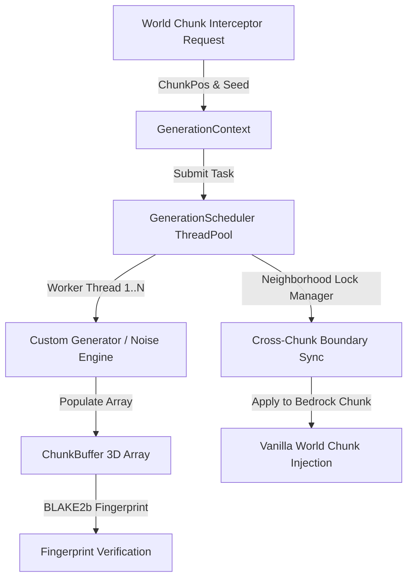

# Endstone WorldGen API

[](https://github.com/TheNINJALLO/endstone-worldgen-api/releases/tag/v0.4.5-beta.27)
[](https://github.com/EndstoneMC/endstone)
[](https://www.minecraft.net/en-us/download/server/bedrock)
[](https://github.com/TheNINJALLO/endstone-worldgen-api/actions)
[](#-direct-release-downloads-v045-beta27)
[](#-c--python-api-quickstart)
[](LICENSE)

A high-performance, detached **Chunk Interceptor**, **Parallel Generation**, and **Scheduler** API for Endstone Bedrock Dedicated Servers (BDS).

Designed for off-main-thread world pre-generation, custom noise samplers, structure placement, and zero-tick chunk modification without causing server lag or thread deadlocks.

---

## 📚 Documentation & Technical Wiki

Comprehensive guides, architecture diagrams, stress testing tutorials, and full API specifications are available on the [**Docsify Documentation Site**](docs/README.md).

---

## 📦 Direct Release Downloads (`v0.4.5-beta.27`)

| Platform | BDS Version | Artifact Filename | Direct Download |
| :--- | :--- | :--- | :--- |
| **Windows x64** | `1.26.32` | `endstone-worldgen-api-v0.4.5-beta.27-bds-1.26.32-windows-x64.dll` | [Download](https://github.com/TheNINJALLO/endstone-worldgen-api/releases/download/v0.4.5-beta.27/endstone-worldgen-api-v0.4.5-beta.27-bds-1.26.32-windows-x64.dll) |
| **Windows x64** | `1.26.33` | `endstone-worldgen-api-v0.4.5-beta.27-bds-1.26.33-windows-x64.dll` | [Download](https://github.com/TheNINJALLO/endstone-worldgen-api/releases/download/v0.4.5-beta.27/endstone-worldgen-api-v0.4.5-beta.27-bds-1.26.33-windows-x64.dll) |
| **Linux x64** | `1.26.32` | `endstone-worldgen-api-v0.4.5-beta.27-bds-1.26.32-linux-x64.so` | [Download](https://github.com/TheNINJALLO/endstone-worldgen-api/releases/download/v0.4.5-beta.27/endstone-worldgen-api-v0.4.5-beta.27-linux-x64.so) |
| **Linux x64** | `1.26.33` | `endstone-worldgen-api-v0.4.5-beta.27-bds-1.26.33-linux-x64.so` | [Download](https://github.com/TheNINJALLO/endstone-worldgen-api/releases/download/v0.4.5-beta.27/endstone-worldgen-api-v0.4.5-beta.27-bds-1.26.33-linux-x64.so) |
| **Python Wheel** | `Universal` | `endstone_worldgen_studio-0.4.5b27-py3-none-any.whl` | [Download](https://github.com/TheNINJALLO/endstone-worldgen-api/releases/download/v0.4.5-beta.27/endstone_worldgen_studio-0.4.5b27-py3-none-any.whl) |

---

## 🏛️ Architecture Overview



---

## ⚡ Quickstart Code Examples

### Python API Example
```python
from endstone_worldgen import (
    GenerationScheduler,
    GenerationContext,
    ChunkPos,
    FlatGenerator,
)

# 1. Initialize multi-worker thread pool
scheduler = GenerationScheduler(workers=4)

# 2. Configure generation context
ctx = GenerationContext(world_seed=12345, dimension="overworld", chunk=ChunkPos(0, 0))

# 3. Generate terrain chunk asynchronously
future = scheduler.generate(ctx, FlatGenerator(surface_y=64, base=1, top=2))
chunk_buffer = future.result()

print(f"Generated Chunk (0,0) Fingerprint: {hex(chunk_buffer.fingerprint())}")
print(f"Surface block at (0,64,0): {chunk_buffer.get(0, 64, 0)}")

scheduler.close()
```

### C++ API Example
```cpp
#include <endstone_worldgen/endstone_adapter.h>
#include <endstone/endstone.hpp>

void generateTerrainAsync(endstone::Server& server) {
    auto* scheduler = server.getServiceManager().getService<endstone_worldgen::GenerationScheduler>();
    if (scheduler) {
        // Submit terrain generation pipeline
    }
}
```

---

## 🎮 In-Game Studio Test Suite (`/wg`)

The repository includes a packaged Python wheel studio plugin [`endstone_worldgen_studio`](examples/python/world_gen_studio_plugin/):

```bash
# Installation via pip in Endstone Python environment:
pip install endstone_worldgen_studio-0.4.5a9-py3-none-any.whl
```

### In-Game Command Reference
| Command | Usage | Description |
| :--- | :--- | :--- |
| `/wg gen <flat\|island\|maze>` | `/wg gen island 0 0` | Submits terrain chunk generation task using specified custom generator. |
| `/wg structure <castle\|arena>` | `/wg structure castle 0 0` | Tests neighborhood locking across a 3x3 chunk boundary grid. |
| `/wg benchmark [chunk_count]` | `/wg benchmark 100` | Runs multi-threaded stress test across N chunks and reports chunks/sec throughput. |
| `/wg inspect [cx] [cz]` | `/wg inspect 0 0` | Displays chunk min/max Y, surface blocks, and BLAKE2b fingerprint hash. |

---

## 📚 Documentation & Wiki

Full technical documentation, architecture deep dives, and API reference manuals are available in the project Wiki:

- 📖 [Documentation Index](docs/README.md)
- 🏗️ [Architecture & Multi-Threading Model](docs/ARCHITECTURE.md)
- ⚙️ [Generators, Contexts & Pipeline Stages](docs/generators_and_stages.md)
- 🔒 [Neighborhood Boundary Lock Engine](docs/neighborhood_locking.md)
- 📘 [Complete API Reference](docs/api_reference.md)
- 💡 [Code Examples & Recipes](examples/python/)

---

## 📜 License

Distributed under the [MIT License](LICENSE).
